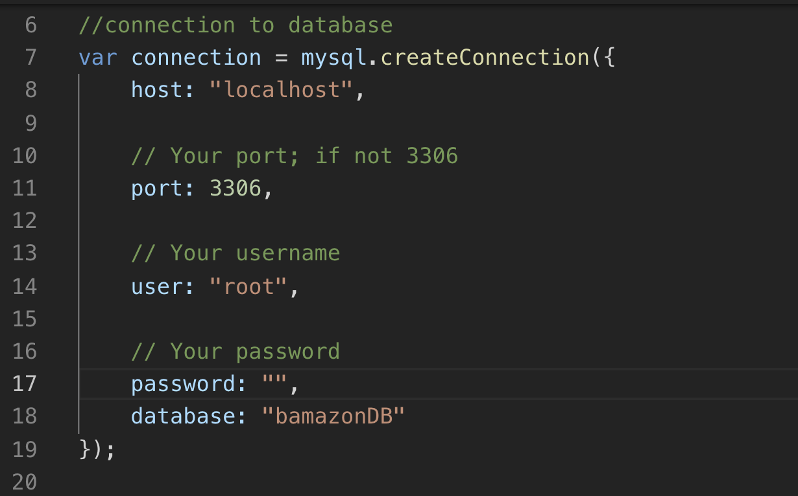
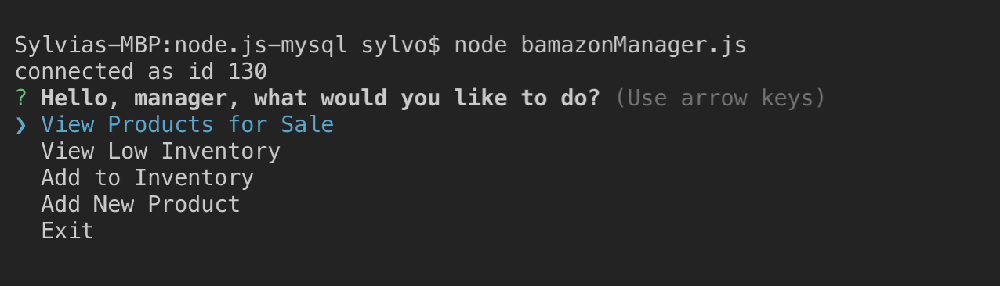
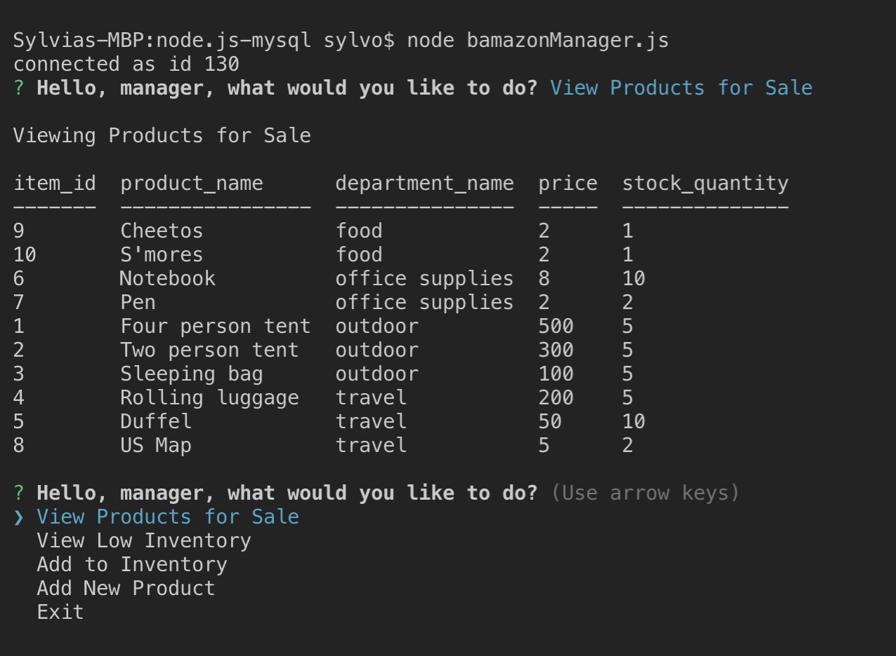
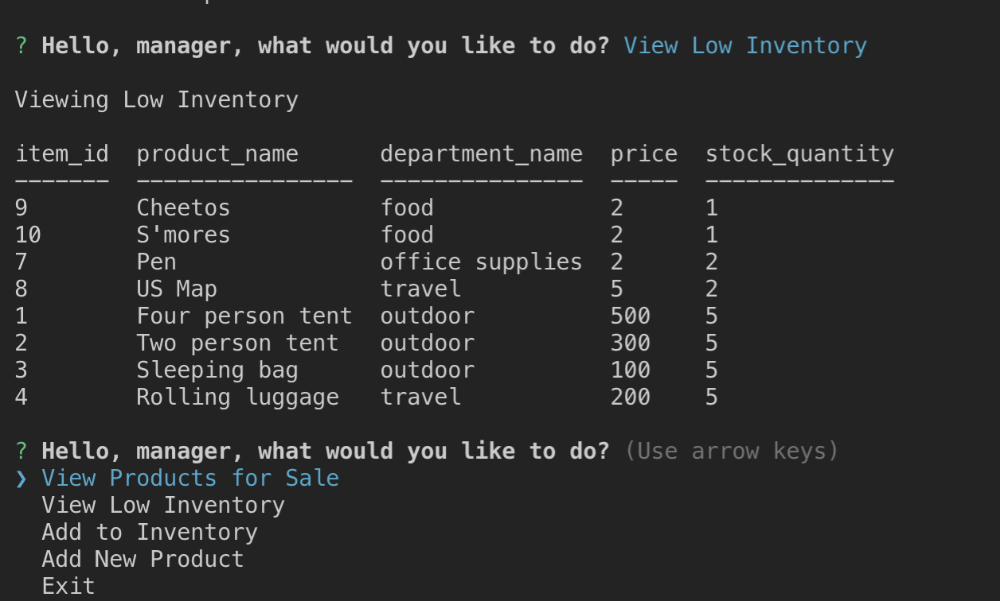
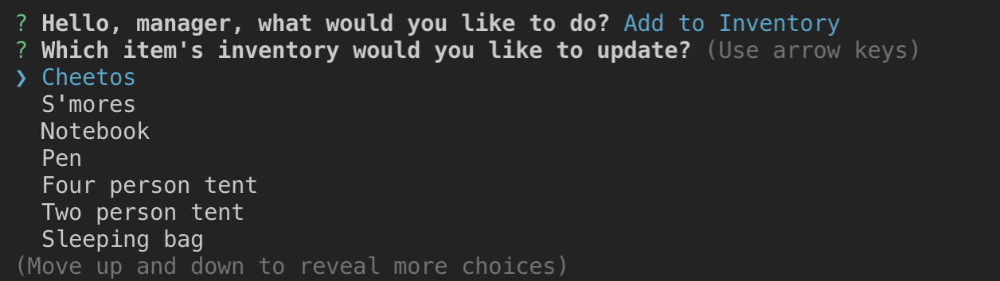
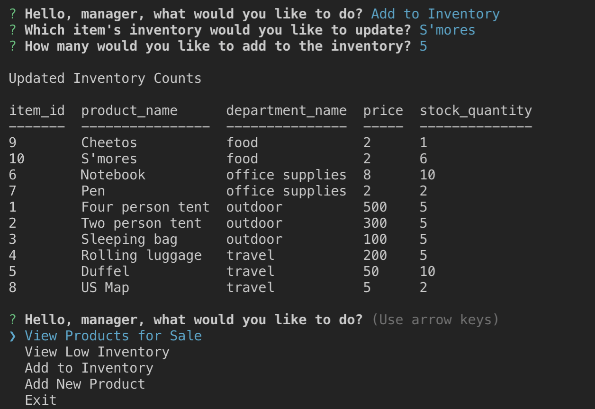
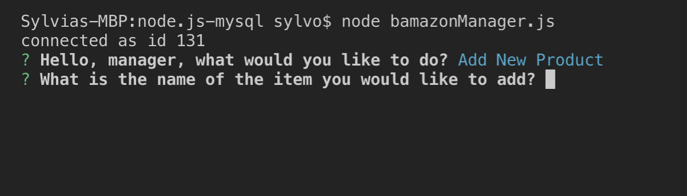
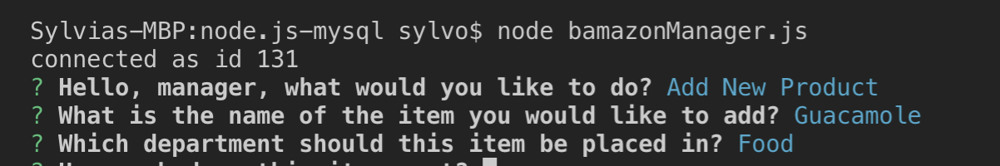
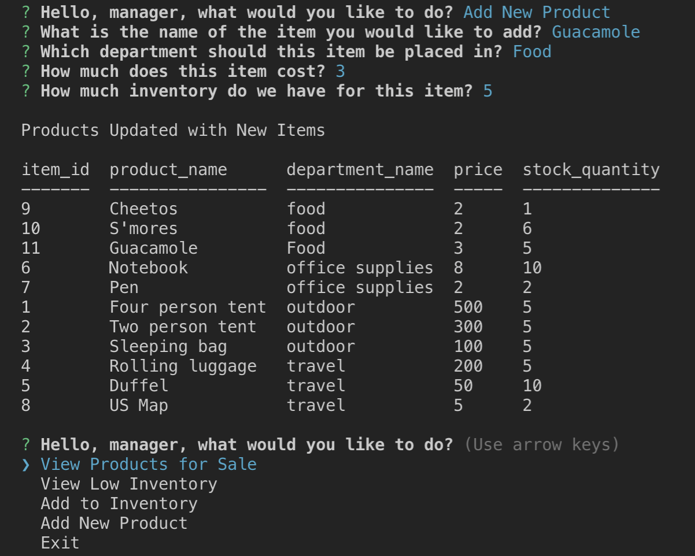
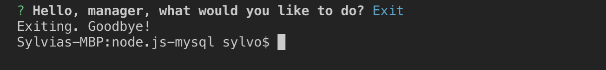

# node.js-mysql
This is a node application that allows a user to "shop" from a locally hosted database, or take actions as the manager.
As the user shops, the inventory will be updated as appropriate.
As the manager works with the program, they will be able to view current products, view low inventory, update inventory, and/or add new products to the store.

### Using the app
To use this app you'll simply need to follow a few steps:

* In the bamazonManager.js and/or bamazonCustomer.js file, locate the password field within the Connection to Database section of the code. You'll find this just below the requirements section towards the top of each file. Enter the password for your local root database.

;

### Customer View
* To begin shopping, type the following:

        node bamazonCustomer.js

* You will then be shown a table with a list of products available for purchase

* Follow the prompts to make your selection followed by the desired quantity

* If the user's desired quantity exceeds inventory quantities, then the user will see how much inventory is on hand and will be prompted to continue shopping.

### Manager View
* To begin manager's tasks, type the following:

        node bamazonManager.js

* You will be prompted to select an action:

* Selecting View Products for Sale will display a table of the products currently available.

* Selecting View Low Inventory will display a table with products that currently have an inventory or 5 or fewer.

* Selecting Add to Inventory will display a series of prompts to gather information on which item to update and the amount of inventory to be added to the current stock. The database will then be updated with this information and a table displaying the new inventory quantities will be displayed.

     * Make Selection
    

    * Input quantity to add to inventory and view updated inventory counts
    

* Selecting Add New Product will display a series of prompts to take in information about the new product. This information will then be input into the database table, and a new table displaying all of the products including the newly added item will be displayed.

    * Input the name of the new product
    
        
    * Input the department
    
        

    * Input price and inventory counts (these values are validated, if NaN then price defaults to 1 and stock defaults to 0)
        

* Selecting Exit will end the connection to the database.

    ;

### Technologies used
* MySQL
* javascript
* node js
* console.table
* inquirer

### Developer Information
Developed by Sylvia Jonon in Austin, TX.