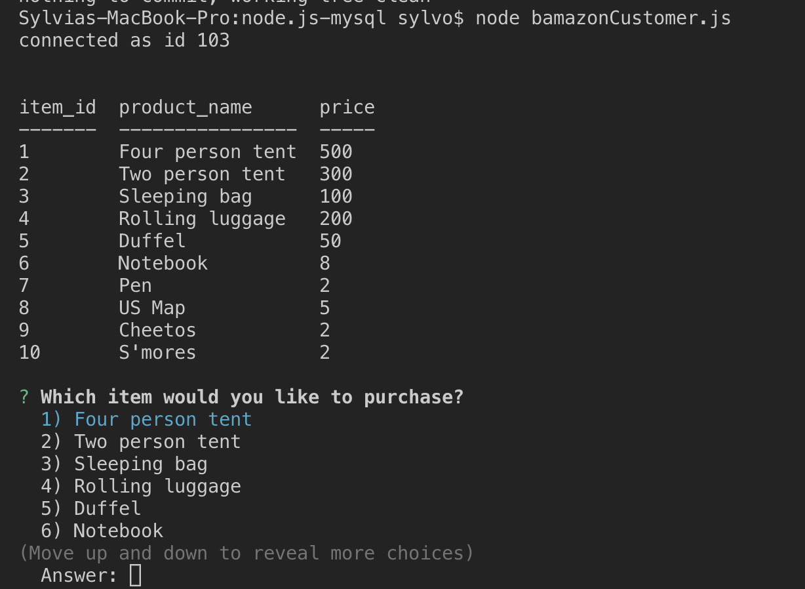
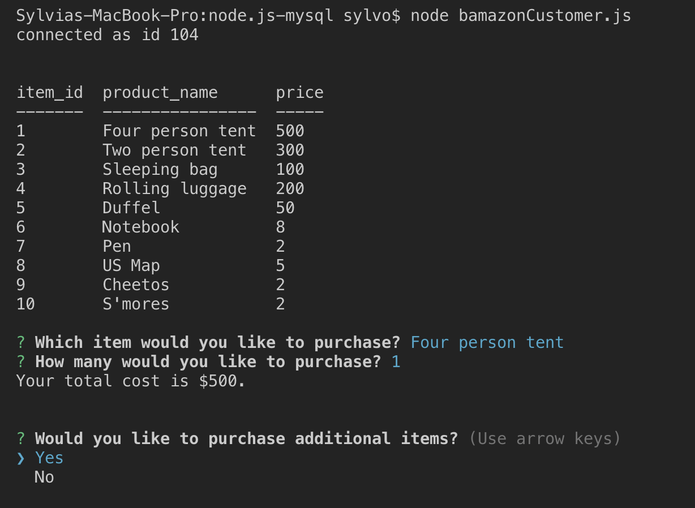
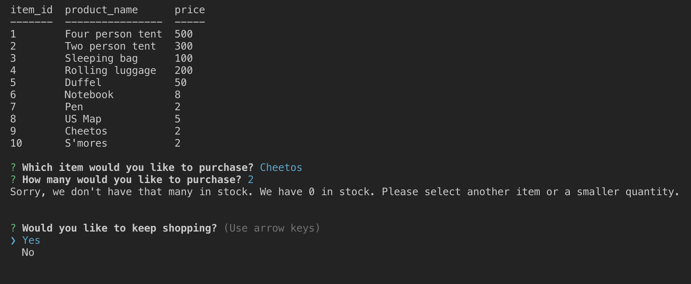

# node.js-mysql
This is a node application that allows a user to "shop" from a locally hosted database. As the user shops, the inventory will be updated as appropriate.

### Using the app
To use this app you'll simply need to follow a few steps:

* To begin shopping, type the following:

        node bamazonCustomer.js

* You will then be shown a table with a list of products available for purchase

* Follow the prompts to make your selection followed by the desired quantity

* If the user's desired quantity exceeds inventory quantities, then the user will see how much inventory is on hand and will be prompted to continue shopping.

### Technologies used
* MySQL
* javascript
* node js
* console.table
* inquirer

### Developer Information
Developed by Sylvia Jonon in Austin, TX.